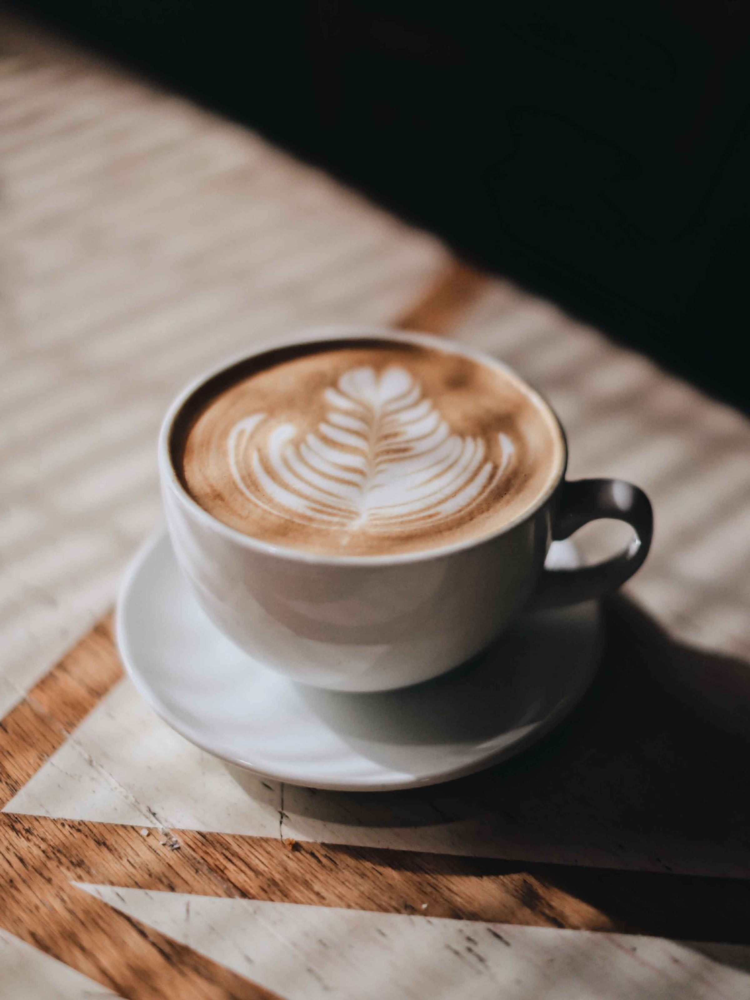

## This is a heading

This is a paragraph.

This is another paragraph.

This is an unordered list:

- This is a list item
- This is another list item
- This is a third list item

This is an ordered list:

1. This is the first list item
2. This is the second list item
3. This is the third list item
